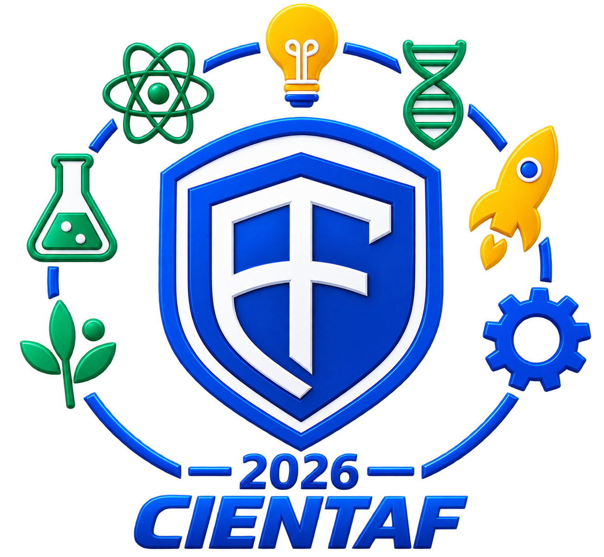

# 🔬 CIENTAF 2026

<p align="center">
  
</p>

<h3 align="center">
  Feira de Ciências, Empreendedorismo e Tecnologia
</h3>

<p align="center">
  <strong>Ideias que transformam o presente e constroem o futuro.</strong>
</p>

<p align="center">
  📅 <strong>22 e 23 de outubro de 2026</strong><br>
  📍 Escola Estadual Aristófanes Fernandes — São Vicente/RN
</p>

<p align="center">

  <a href="https://cientaf.vercel.app/" target="_blank">
    🌐 Site Oficial
  </a>

</p>

---

## 🌟 Sobre a CIENTAF

A **CIENTAF — Feira de Ciências, Empreendedorismo e Tecnologia** é uma iniciativa da **Escola Estadual Aristófanes Fernandes**, localizada em São Vicente, no Rio Grande do Norte.

O evento tem como propósito aproximar a **ciência, a tecnologia, a inovação e a criatividade do cotidiano dos estudantes**, criando um espaço para apresentação de ideias, projetos, experiências e soluções desenvolvidas no ambiente escolar.

A CIENTAF valoriza o estudante como **protagonista do processo de aprendizagem**, incentivando a investigação, a experimentação, o pensamento crítico e a busca por soluções para problemas reais.

> 💡 **Ciência não é apenas aprender. É investigar, questionar, criar e transformar.**

---

# 🚀 CIENTAF 2026

A edição de **2026** acontecerá nos dias:

### 📅 22 de outubro — Quinta-feira

🕡 **18h30**

A programação de quinta-feira será dedicada à:

- 🎉 Abertura oficial da CIENTAF 2026
- 🎭 Apresentações culturais
- 🤝 Integração entre escola e comunidade
- 🌟 Celebração do início do evento

### 📅 23 de outubro — Sexta-feira

🕣 **08h30 às 15h00**

Durante a sexta-feira acontecerão as atividades relacionadas à apresentação e visitação dos trabalhos desenvolvidos pelos estudantes.

---

# 🎯 Objetivos

A CIENTAF 2026 busca:

- 🔬 Estimular o interesse pela ciência;
- 💻 Incentivar o uso criativo da tecnologia;
- 💡 Desenvolver a criatividade e a capacidade de inovação;
- 🧠 Estimular o raciocínio lógico e o pensamento crítico;
- 🧪 Incentivar a investigação e a experimentação;
- 🚀 Valorizar o protagonismo dos estudantes;
- 🤝 Promover a integração entre escola e comunidade;
- 🌱 Estimular a busca por soluções sustentáveis;
- 💼 Desenvolver o espírito empreendedor;
- 🎓 Aproximar os estudantes da cultura científica;
- 🌎 Demonstrar como o conhecimento pode contribuir para transformar a realidade.

---

# 🧩 Áreas de destaque

A CIENTAF integra diferentes áreas do conhecimento e possibilidades de criação.

### 🔬 Ciência

Investigação, experimentação, descobertas e construção do conhecimento científico.

### 💻 Tecnologia

Desenvolvimento de soluções utilizando recursos tecnológicos e ferramentas digitais.

### 💡 Inovação

Novas ideias, produtos, experiências e maneiras de solucionar problemas.

### 🚀 Empreendedorismo

Criatividade, planejamento, desenvolvimento de ideias e criação de soluções com potencial de impacto.

### 🌱 Sustentabilidade

Projetos que promovam consciência ambiental e soluções para uma sociedade mais sustentável.

### 🎨 Cultura

Valorização da criatividade, expressão artística e manifestações culturais.

---

# 👨‍🔬 Protagonismo estudantil

Um dos principais pilares da CIENTAF é a participação ativa dos estudantes.

Os alunos são incentivados a:

- identificar problemas;
- formular perguntas;
- pesquisar;
- testar hipóteses;
- desenvolver soluções;
- trabalhar em equipe;
- apresentar resultados;
- compartilhar conhecimentos.

Dessa forma, a feira transforma o estudante de espectador em **protagonista da produção do conhecimento**.

---

# 🤝 Ciência e comunidade

A CIENTAF é um evento **aberto à comunidade**.

A participação da comunidade escolar e da sociedade contribui para aproximar o conhecimento produzido dentro da escola das pessoas que fazem parte da realidade local.

A feira busca criar um ambiente de:

**Conhecimento → Experimentação → Compartilhamento → Transformação**

---

# 🗓️ Programação

| Data | Horário | Atividade |
|---|---:|---|
| **22/10/2026** | 18h30 | 🎉 Abertura oficial |
| **22/10/2026** | Após a abertura | 🎭 Apresentações culturais |
| **23/10/2026** | 08h30 | 🔬 Início das atividades |
| **23/10/2026** | 08h30–15h00 | 🧪 Apresentação e visitação dos trabalhos |
| **23/10/2026** | 15h00 | 🏁 Encerramento das atividades |

> 📌 A programação apresentada neste README corresponde às informações definidas para a CIENTAF 2026.

---

# 📍 Local

## Escola Estadual Aristófanes Fernandes

📍 **São Vicente — Rio Grande do Norte**

A escola será o espaço de encontro entre estudantes, professores, comunidade e conhecimento durante a CIENTAF 2026.

---

# 🌐 Site oficial

Todas as informações e atualizações do evento podem ser acompanhadas através do site oficial:

### 👉 https://cientaf.vercel.app/

O site foi desenvolvido para centralizar informações sobre:

- 📅 Datas;
- 🕐 Programação;
- 📍 Localização;
- 📸 Galeria;
- 📢 Informações do evento;
- 📬 Contato.

---

# 🖥️ Sobre este projeto

Este repositório contém o código-fonte do **site oficial da CIENTAF**.

A aplicação foi desenvolvida com tecnologias web fundamentais, priorizando:

- ⚡ simplicidade;
- 📱 responsividade;
- 🎨 identidade visual;
- ♿ acessibilidade;
- 🚀 desempenho;
- 🧭 facilidade de navegação;
- 🔧 facilidade de manutenção.

---

# 🛠️ Tecnologias utilizadas

O projeto utiliza tecnologias web modernas e leves:

| Tecnologia | Utilização |
|---|---|
| `HTML5` | Estrutura da aplicação |
| `CSS3` | Identidade visual e responsividade |
| `JavaScript` | Interatividade e funcionalidades |
| `Google Maps` | Localização do evento |
| `QR Code` | Acesso rápido ao site |
| `Google Drive` | Armazenamento das mídias |

---

# 📁 Estrutura do projeto

```text
cientaf/
│
├── 📄 index.html
├── 🎨 style.css
├── ⚙️ script.js
│
├── 📁 src/
│   ├── 🖼️ logo-cientaf.png
│   └── 🖼️ banner.jpeg
│
└── 📄 README.md